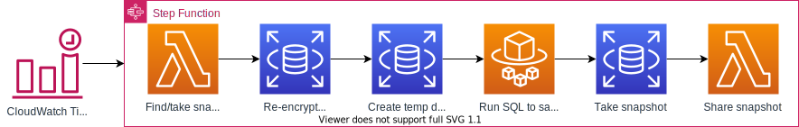

# CDK Construct for RDS Sanitized Snapshots

[][2]
[][3]
[][4]
[][5]
[][6]
[](https://github.com/CloudSnorkel/cdk-rds-sanitized-snapshots/actions/workflows/release.yml)
[](https://github.com/CloudSnorkel/cdk-rds-sanitized-snapshots/blob/main/LICENSE)

Periodically take snapshots of RDS databases, sanitize them, and share with selected accounts.

Use this to automate your development and/or QA database creation, instead of forcing them to use a database that was
created last year and was kind of kept in shape by random acts of kindness. Developers and QA love real data and this
lets you create non-production databases with sanitized production data. Use the sanitization step to delete passwords,
remove credit card numbers, eliminate PII, etc.

See [Constructs Hub][1] for installation instructions and API in all supported languages.

## Overview



This project supplies a CDK construct that sets up a step function and a timer to execute this function. The
function will create a sanitized snapshot of a given database and share it with configured accounts. Those accounts can
then create new databases from those snapshots.

The step function does the following to create the snapshot:

1. Get a snapshot of the given database by either:
    * Finding the latest snapshot for the given database
    * Creating and waiting for a new fresh snapshot
2. Re-encrypt snapshot if KMS key is supplied
3. Create a temporary database from the snapshot
4. Wait for the database to be ready
5. Reset the master password on the temporary database to a random password
6. Wait for the password to be set
7. Use a Fargate task to connect to the temporary database and run configured SQL statements to sanitize the data
8. Take a snapshot of the temporary database
9. Optionally share the snapshot with other accounts (if you have separate accounts for developers/QA)
10. Delete temporary database and snapshot

## Usage

1. Confirm you're using CDK v2
2. Install the appropriate package
   1. [Python][3]
      ```
      pip install cloudsnorkel.cdk-rds-sanitized-snapshots
      ```
   2. [TypeScript or JavaScript][2]
      ```
      npm i @cloudsnorkel/cdk-rds-sanitized-snapshots
      ```
   3. [Java][4]
      ```xml
      <dependency>
      <groupId>com.cloudsnorkel</groupId>
      <artifactId>cdk.rds.sanitized-snapshots</artifactId>
      </dependency>
      ```
   4. [Go][5]
      ```
      go get github.com/CloudSnorkel/cdk-rds-sanitized-snapshots-go/cloudsnorkelcdkrdssanitizedsnapshots
      ```
   5. [.NET][6]
      ```
      dotnet add package CloudSnorkel.Cdk.Rds.SanitizedSnapshots
      ```
3. Use `RdsSanitizedSnapshotter` construct in your code (starting with default arguments is fine)

### Code Sample

```typescript
let vpc: ec2.Vpc;
let databaseInstance: rds.DatabaseInstance;

new RdsSanitizedSnapshotter(this, 'Snapshotter', {
  vpc: vpc,
  databaseInstance: databaseInstance,
  script: 'USE mydb; UPDATE users SET ssn = \'0000000000\'',
})
```

## Encryption

The new snapshot will be encrypted with the same key used by the original database. If the original database wasn't
encrypted, the snapshot won't be encrypted either. To add another step that changes the key, use the KMS key parameter.

See [AWS documentation](https://docs.aws.amazon.com/AmazonRDS/latest/UserGuide/USER_ShareSnapshot.html) for instructions
on giving other accounts access to the key.

## Troubleshooting

* Check the status of the state machine for the step function. Click on the failed step and check out the input, output
  and exception.

## Testing

```
npm run bundle && npm run integ:default:deploy
```

[1]: https://constructs.dev/packages/@cloudsnorkel/cdk-rds-sanitized-snapshots/
[2]: https://www.npmjs.com/package/@cloudsnorkel/cdk-rds-sanitized-snapshots
[3]: https://pypi.org/project/cloudsnorkel.cdk-rds-sanitized-snapshots
[4]: https://search.maven.org/search?q=g:%22com.cloudsnorkel%22%20AND%20a:%22cdk.rds.sanitized-snapshots%22
[5]: https://pkg.go.dev/github.com/CloudSnorkel/cdk-rds-sanitized-snapshots-go/cloudsnorkelcdkrdssanitizedsnapshots
[6]: https://www.nuget.org/packages/CloudSnorkel.Cdk.Rds.SanitizedSnapshots/
